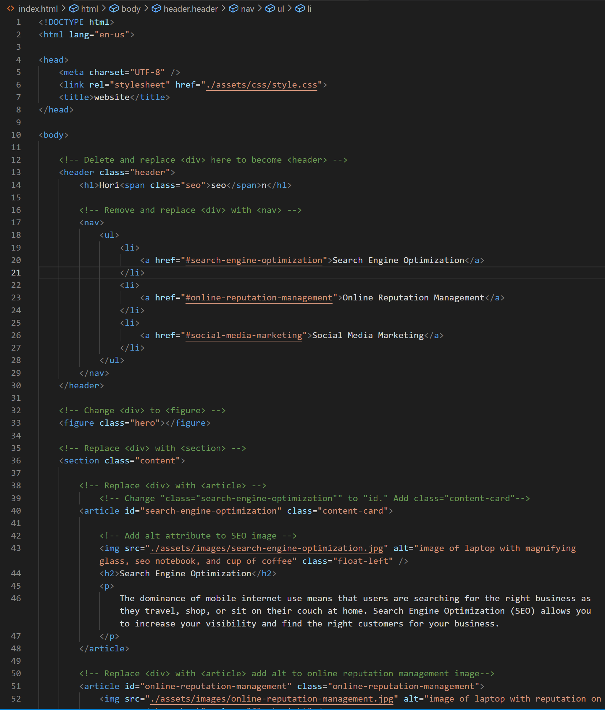
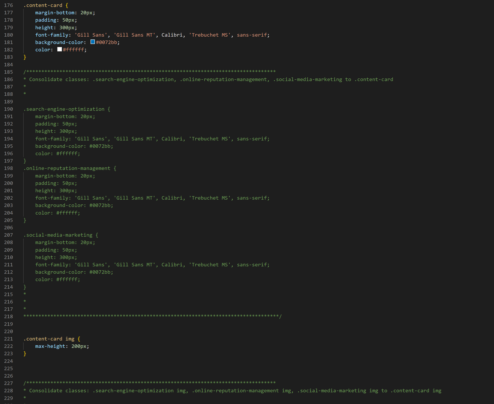

# Code-Refactor

Improving HTML semantics and accesibility, and optimizing CSS

## Webpage Restructuring and Enhancements

- HTML & CSS show semantic and accessibility characteristics.

- HTML elements follow a logical structure.

- Image elements, including icons, have alt attributes.

- Heading attributes fall in sequential order.

- Title element is concise and descriptive.

## Mockup

URL to the Horiseon webpage: https://twenty-fourseven.github.io/code-refactor/

## Usage

Below you will find screenshots of selected sections of code from the HTML and CSS files for this project. The rendered website should match the screenshots.

    
    
    

## Credits

The original code was from Xandromus of the University of Washington's coding bootcamp.
